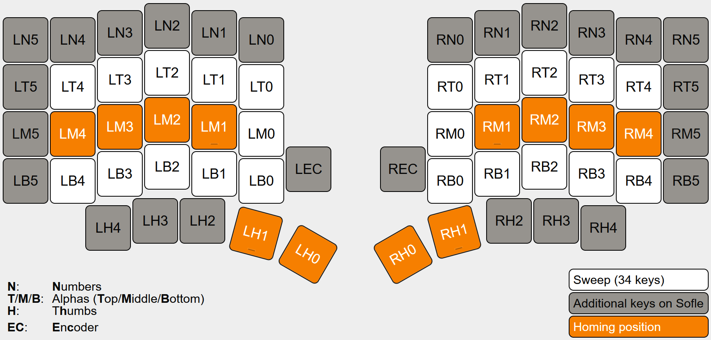

# Key-labels collection

These layout headers define _easy to remember_ "key-labels" for many popular keyboards, which can be
used instead of numeric key-positions to configure position-based properties (e.g., in combos).

## Table of contents

- [Standardization](#standardization)
- [Usage](#usage)
- [Examples](#examples)

## Standardization

Key-labels are _standardized_ to make keymaps portable across keyboards. All key-labels are composed
of three parts:

```c
<side><row><column>  // e.g., LT0 or RB1
```

Whenever reasonably possible, all layout definitions should follow these rules:

### `<side>`-tag rules

1. Keys on the left side are labeled `L`, keys on the right side are labeled `R` (even on non-split
   keyboards)

### `<row>`-tag rules

2. The three core rows (where the alpha keys usually go) are `T`, `M`, and `B` (short for **T**op,
   **M**iddle, **B**ottom)
3. The row above `T` is labeled `N` (as this is where usually the numbers go)
4. If there is only one row below `B`, it is labeled `H` (short for t**H**umbs)
5. If there are multiple rows below `B`, the lowest one is `H`
6. Encoders have a `<row>`-tag of `EC` irrespective of their location
7. If there are row(s) above `N` or in between `B` and `H`, they can be labeled as fitting

### <`column`>-tag rules

8. Columns are numbered from the inside to the outside
9. The 5-core columns (where the alpha keys usually go) are numbered `0` to `4`, with `1` being the
   homing position of the index finger
10. Thumbs are numbered so that the homing position is between `0` and `1`
11. Encoder-rows may omit the column number if uniqly identified by `<side>` and `<row>`

For instance, the labels for the 60-key _Sofle_ and the 34-key _Sweep_ are defined as follows:



## Usage

See the [key-labels directory](include/zmk-helpers/key-labels/) for a list of all currently
available layout headers. To use the key-labels, source the layout header for your keyboard near the
top of your keymap:

```c
#include "zmk-helpers/key-labels/34.h"  // replace by the correct header for your keyboard
```

## Examples

See the following for examples how to configure behaviors using key-labels.

<details><summary>Combos</summary>

This defines a "copy"-combo for the middle + ring finger on the left bottom row, and a "paste"-combo
for the index + middle finger on the left bottom row. Both combos are active on all layers.

```c
ZMK_COMBO(copy,  &kp LC(C), LB2 LB3, ALL)
ZMK_COMBO(paste, &kp LC(V), LB1 LB2, ALL)
```

</details>

<details><summary>Positional homerow mods</summary>

Here we use ZMK's
[positional hold-tap](https://zmk.dev/docs/behaviors/hold-tap#positional-hold-tap-and-hold-trigger-key-positions)
feature to make homerow mods only trigger with "opposite hand" keys. Using key-labels makes this
straightforward:

```c
/* define left and right hand keys */
#include "zmk-helpers/key-labels/36.h"                                      // replace with correct key-labels header
#define KEYS_L LT0 LT1 LT2 LT3 LT4 LM0 LM1 LM2 LM3 LM4 LB0 LB1 LB2 LB3 LB4  // left-hand keys
#define KEYS_R RT0 RT1 RT2 RT3 RT4 RM0 RM1 RM2 RM3 RM4 RB0 RB1 RB2 RB3 RB4  // right-hand keys
#define THUMBS LH2 LH1 LH0 RH0 RH1 RH2                                      // thumb keys

/* left-hand HRMs */
ZMK_HOLD_TAP(hml,
    flavor = "balanced";
    tapping-term-ms = <280>;
    bindings = <&kp>, <&kp>;
    hold-trigger-key-positions = <KEYS_R THUMBS>;
)

/* right-hand HRMs */
ZMK_HOLD_TAP(hmr,
    flavor = "balanced";
    tapping-term-ms = <280>;
    bindings = <&kp>, <&kp>;
    hold-trigger-key-positions = <KEYS_L THUMBS>;
)
```

</details>
